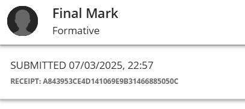

# CV Submission

---

##  📄 Evidence
I completed the CV Submission. Below is my CV as evidence in pdf and my submission.

[CV Document](evidence/document/Tsholofelo%20Mabidikane.pdf)

---

## 🧠 Reflection (Using STAR)

**S - Situation:**
I was required to do a CV review checking if my CV had everything it should have which I then had to submit merged with my ID and matric certificate. 

**T - Task:**
Create a CV and upload it.

**A - Action:**
I created my CV and checked if it has everything it should contain then submitted it.

**R - Result:**
I learned to create a good CV.
