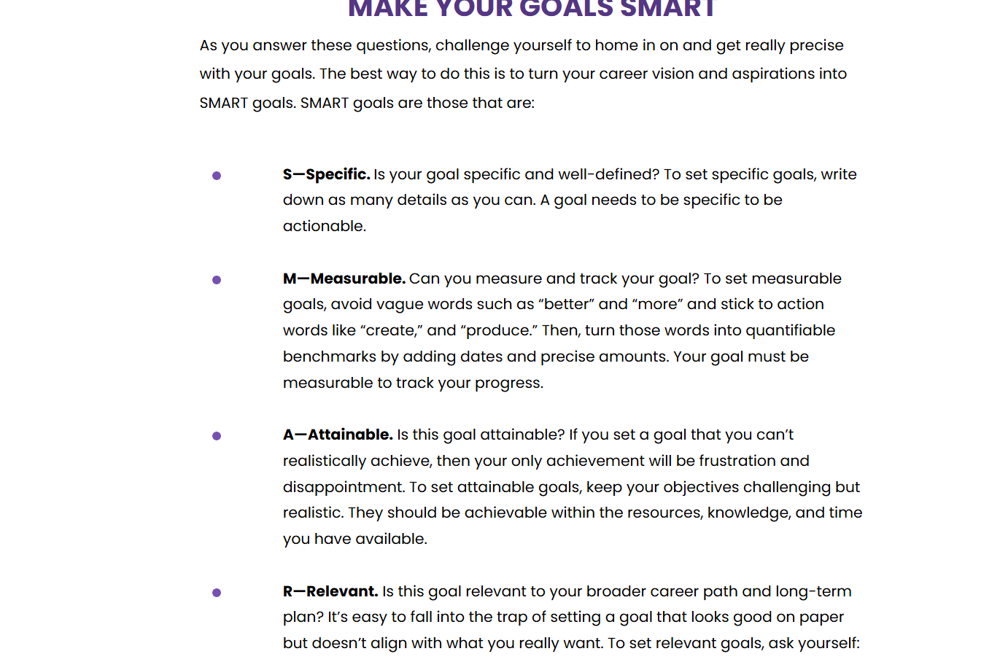
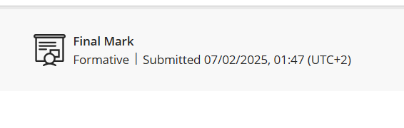

# Career Counselling

##  📄 Evidence 
I completed the Career Development assessment and completed the quiz after. I will be providing screenshots of the content of the assessment and my submission.

 

---

## 🧠 Reflection (Using STAR)

**S - Situation:**
I was required to complete a assessment as part of Work Readiness. The assessment covered development model, developing a action plan, ideas to get me started on brainstorming if I am struggling, and aimed to help me understand how to make my goals smart, job versus career and knowing myself.  

**T - Task:**
I was required to read through all the content, understand it, and complete a short quiz at the end to demnonstrate my understanding.

**A - Action:**
I worked through each part of the assessment, and took screenshots of the content, took notes, and made sure I understood the content before attempting the quiz.

**R - Result:**
Through the activity, I gained a better understanding of how to make my goals smart using the SMART goals method, and gaining a better understanding of the 70/20/10 Development Model and ask myself certain questions to start brainstorming.
