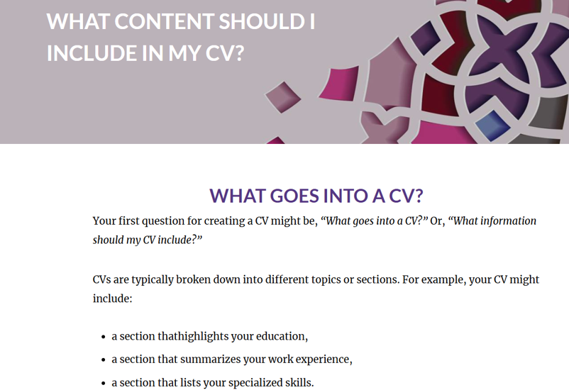

# Create a CV

##  📄 Evidence

I completed the Create a CV assessment and completed the short quiz after. Below are the screenshots of the content of the assessment and my submission.

---

## 🧠 Reflection (Using STAR)

**S - Situation:**
I was required to complete a assessment as part of Work Readiness. The assessment covered what is a CV and why it is important, what goes into a CV, the sections that should be in a CV, mandatory and optional sections, 
examples of what each section should/may look like and writing a cover letter and how to strucutre it. 

**T - Task:**
I was required to read through the assessment, understand it, and complete a short quiz at the end to demonstrate my understanding. 

**A - Action:**
I read through the assessment, took notes, completed the mini activities, and made sure I understood the content before completing the quiz.

**R - Result:**
I learned how to structure a CV, what I had to include in it, the sections I had to have in the CV, the mandatory and optional sections. I learned how to write a good cover letter.  
