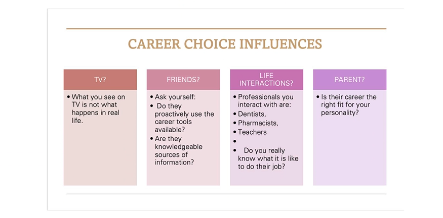
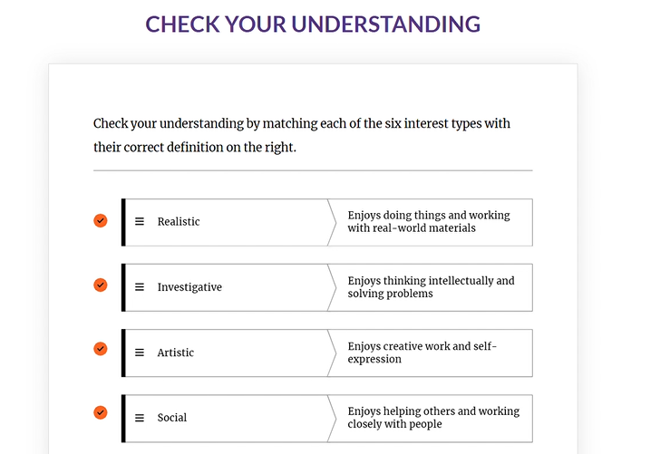
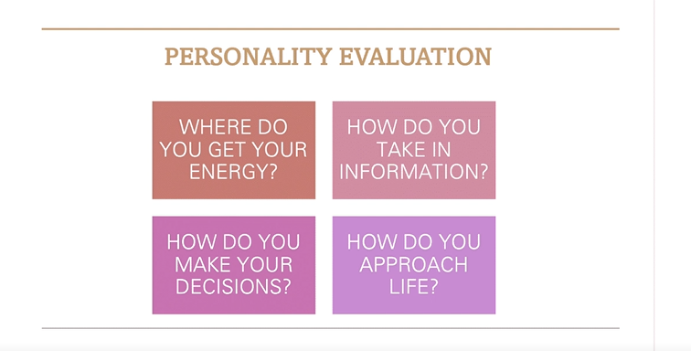
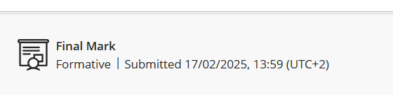

# Personality Assessment

##  📄 Evidence 
I completed the Personality Assessment and completed the quiz after. Below will be screenshots of the content of the assessment and my submission.

---

##  🧠  Reflection (Using STAR)

**S - Situation:**
I was required to complete a assessment as part of Work Readiness. The assessment covered understanding personality profiling, how to evaluate my personality, understanding the six personality types, and personality match and career.

**T - Task:**
 I was required to read through the content, understand it, complete mini activities in the assessment, and complete a short quiz at the end to demonstrate my understanding.

**A - Action:**
I read through the assessment, took notes, completed the mini activities in the assessment, and made sure I understood the content before attempting the quiz.

**R - Result:**
I learned about career choice influences, that certain individual's and things can have an influence on an individual's career, I learned about personality traits that can get me hired. I gained a better understanding of questions I should ask myself as a personality evaluation, and learned about the six personality types and matching the personality to a career.
