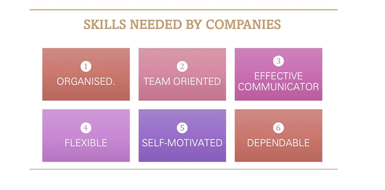
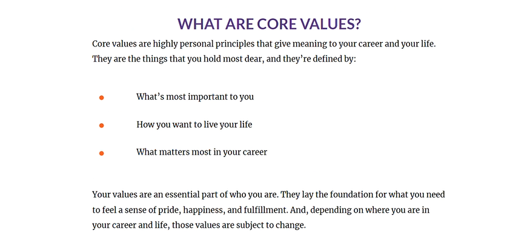
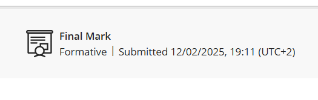

# Skills and Interests

## 📄 Evidence
I completed the Skills and Interests assessment and completed the quiz after. I will be providing screenshots of the content of the assessment and my submission.

---

## 🧠 Reflection (Using STAR)

**S - Situation:**
I was required to complete a assessment as part of Work Readiness. The assessment covered identifying my values, interests, skills, knowing skills that are needed by companies, and identifying achievements and accomplishments, and aimed to help me identify my core values and know my interests.  

**T - Task:**
I was required to read through all the content, understand it and where it may apply in the work environment, and complete a short quiz at the end to demonstrate my understanding.

**A - Action:**
I worked through the assessment, took notes, and made sure I understood before attempting the quiz. 

**R - Result:**
I gained a better understanding of my core values, defined my values, discovered my interests and professional interests. I gained a better understanding of adaptive and transferable skills.
